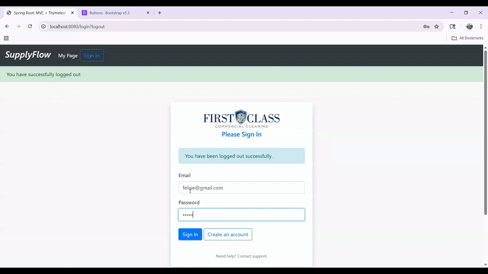
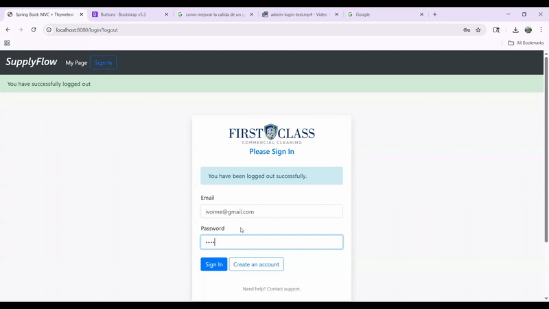
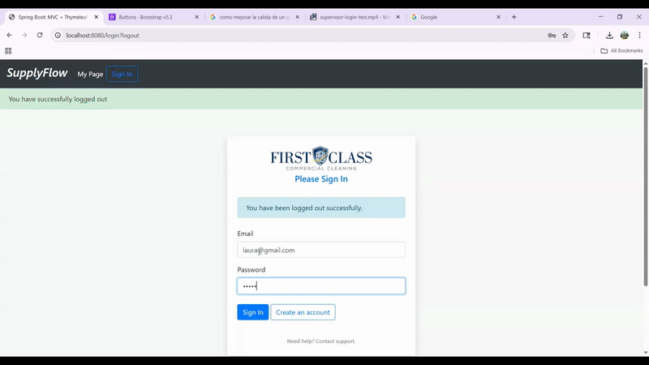
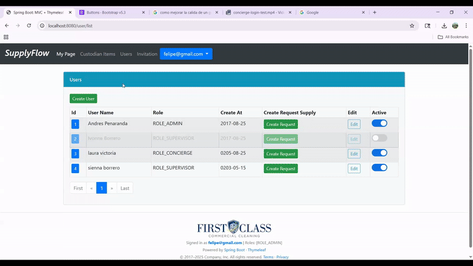
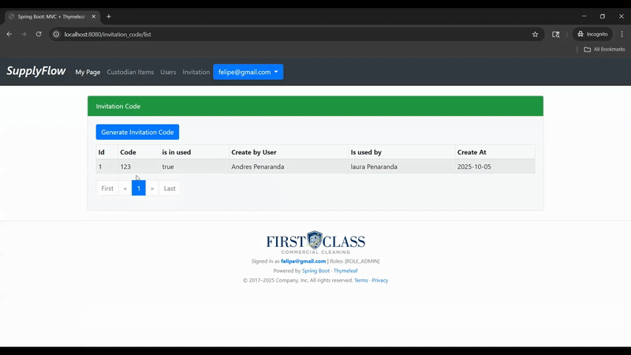
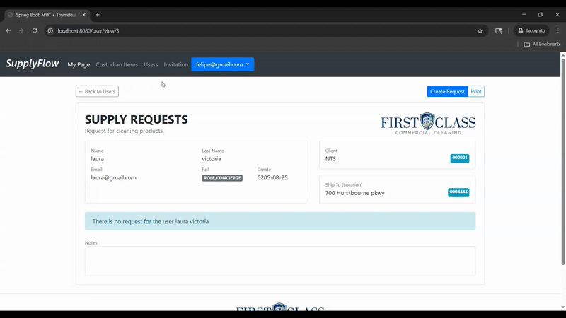

# SupplyFlow

**SupplyFlow** is an internal procurement **management system for cleaning supplies** with user roles, supplier management, email-based order delivery, and order tracking.

Its main purpose is to allow housekeeping staff to request products, while administrators manage inventory, locations, and permissions with fine-grained control.

Designed as a monolithic MVC application using Spring Boot and Thymeleaf, simulating how small comapnies manage supply requests and vendor communications.

---

## Main Features

 **User and Role Management**
  - Roles: `ADMIN`, `SUPERVISOR`, `CONCIERGE`.
  - Registration and validation with **unique email and hashed password**.
  - Access control with **Spring Security**, configured with `HttpSecurity` and `@PreAuthorize` annotations.

 **Request Module**
  - Authorized staff can create cleaning supply requests.
  - Each request contains multiple `RequestItem` entries linked to products.
  - Validations to prevent requests without an active user or assigned site.

 **Product Inventory**
  - CRUD operations with role-based restrictions.
  - Uniqueness validation for key fields (`productCode`, `email`, etc.).
  - Historical stock management via relationship with `SupplyItem`.

 **Security**
  - **Defense in depth** approach:
    - Public and private route filtering.
    - Method-level validation with `@PreAuthorize`.
    - Role-based access: only `ADMIN` and `SUPERVISOR` can view all users; `CONCIERGE` can only view their own profile.

 **User Interface**
  - Dynamic forms with **Thymeleaf + jQuery (AJAX)**.
  - Product search with autocomplete.
  - Toggle buttons to activate/deactivate users with CSS validation support.

---

##  Architecture & Entity Relationships

```text
User 1 ── * Request 1 ── * RequestItem * ── 1 SupplyItem ── 1 Product
│
├── 1 Role (each user is assigned exactly one role)
│
├── 1 CustomerSite (assignedSite) ── 1 CustomerAccount
│
└── 1 InvitationCode (optional, unique per user for registration)
```

## UML - Model Domain
## Domain Model


# Flowchart
```mermaid
  A[Visitor] --> B{Has an account?}
  B -- No --> C[Public Registration (/register)]
  C --> C1[Enter invitationCode]
  C1 --> D{Valid and unused?}
  D -- No --> C2[Show error<br/>"Invalid or used code"]
  D -- Yes --> E[Create User (ROLE_CONCIERGE)]
  E --> F[Mark invitation_code.used=true<br/>usedBy = new User]
  F --> G[Redirect to /login]

  B -- Yes --> H[/Login/]
  H --> I[Spring Security<br/>(JdbcUserDetailsManager)]
  I --> J{Authentication OK?}
  J -- No --> H2[Invalid credentials]
  J -- Yes --> K{Authorization}
  K -- ADMIN/SUPERVISOR --> L[Admin: generate codes,<br/>manage users/sites]
  K -- CONCIERGE --> M[Ops: view/edit own profile,<br/>create Requests]
  K -- Otherwise --> N[403 - Access denied]

```
# Public Registration (Invitation Code Service)
```mermaid
flowchart LR
  R1[POST /register<br/>UserForm] --> R2{invitationCode empty?}
  R2 -- Yes --> R0[Show field error] --> R1
  R2 -- No --> R3[Normalize (trim + uppercase)]
  R3 --> R4[findByCode(code)]
  R4 --> R5{Found?}
  R5 -- No --> R0[Error: not found] --> R1
  R5 -- Yes --> R6{Already used?}
  R6 -- Yes --> R0[Error: already used] --> R1
  R6 -- No --> R7[Create User + assign ROLE_CONCIERGE]
  R7 --> R8[Save User]
  R8 --> R9[inv.used=true; inv.usedBy=user]
  R9 --> R10[Save InvitationCode]
  R10 --> R11[Redirect /login (success)]
```
# Login & Authorization (Spring Security + JDBC)
```mermaid
flowchart TD
  L1[Login form] --> L2[AuthenticationManager]
  L2 --> L3[DaoAuthenticationProvider]
  L3 --> L4[JdbcUserDetailsManager<br/>custom SQL queries]
  L4 --> L5{Enabled & password OK?}
  L5 -- No --> L6[Login error]
  L5 -- Yes --> L7[@PreAuthorize / antMatchers rules]
  L7 -- ADMIN/SUPERVISOR --> L8[Access admin endpoints]
  L7 -- CONCIERGE --> L9[Limited access + @userSecurity.isSelf(id)]
  L7 -- No permission --> L10[403]
```

**User** →

- **Can have an assigned CustomerSite.**

- **Must be linked to exactly one Role.**

- **May be created/validated through an InvitationCode.**

**Request** → belongs to a User and contains multiple RequestItems.

**RequestItem** → links a Request with a SupplyItem.

**SupplyItem** → has a one-to-one relationship with Product.

**Role** → defines user permissions and system access.

**CustomerSite** → location/site assigned to a User; belongs to a CustomerAccount.

**CustomerAccount** → represents the client organization; can have multiple CustomerSites.

**InvitationCode** → unique code required for user self-registration (ensures controlled onboarding).

# Demonstration on Login based on role - Request items - Invitation code

## Admin Loggin


## Supervisor Login


## Concierge Login


## Among other validation on User form - same for Supply Items


## Enable - Disable user


## Invitation code to new User


## Request supply items


## Dependencies

This project targets **Java 17+** and **Spring Boot 3.x**.

### Core
- `spring-boot-starter-web` – MVC, JSON
- `spring-boot-starter-thymeleaf` – server-side rendering
- `thymeleaf-extras-springsecurity6` – security dialect for Thymeleaf
- `spring-boot-starter-data-jpa` – ORM with Hibernate
- `spring-boot-starter-security` – authN/authZ (BCrypt, filters, `@PreAuthorize`)
- `spring-boot-starter-validation` – Bean Validation (Jakarta)
- `spring-boot-starter-jdbc` – JDBC utilities

### Database
- `mysql-connector-j` – MySQL driver (prod)
- `com.h2database:h2` – in-memory DB (dev/test)

### Frontend (WebJars)
- `org.webjars:bootstrap`
- `org.webjars:jquery`
- `org.webjars:jquery-ui`

# Tech Stack

- **Backend:** Spring Boot (Spring MVC, Spring Data JPA, Spring Security)

- **Database:** MySQL / H2 (dev mode)

- **Frontend:** Thymeleaf, Bootstrap, jQuery (AJAX, autocomplete)

- **Security:** BCrypt password hashing, validation with annotations, custom queries (JdbcUserDetailsManager)

- **Version Control:** Git/GitHub

# Key Decisions

- **Authentication**: JDBC with custom queries for mapping users and roles.

- **Validations:** Uniqueness constraints at entity level to ensure integrity (emails, product codes).

- **Security:** Centralized in HttpSecurity (filters) + @PreAuthorize (method-level).

- **User Experience:** Adopted jQuery AJAX in forms for smoother navigation and fewer full-page reloads.

# Future Improvements

- Email validation and activation using a unique validation code sent by admin.

- Real-time notifications, consuming Gmail API

# Author

## Developed by Andre Hernan
- CIT/CS student and aspiring software engineer, passionate about enterprise applications using Spring Boot.